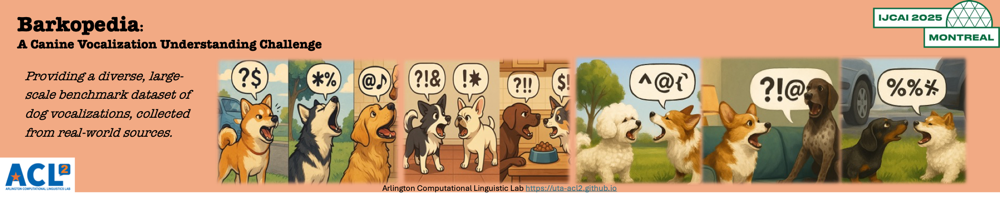

# Barkopedia: A Canine Vocalization Understanding Challenge <!-- omit from toc -->

## 📣 Updates

**2025-04-15**  
- Competition officially launches; training data is released.

## 📊 Overview

Dogs use vocalizations to communicate intentions, emotions, and contextual cues. While prior research shows that machine learning models can classify dog barks based on context, individual identity, and emotion, existing studies often suffer from limited scale, generalizability, or robustness due to small datasets or handcrafted features.

This challenge, hosted at [IJCAI 2025](https://2025.ijcai.org/), addresses these issues by providing a large-scale, diverse benchmark dataset of real-world dog vocalizations sourced from YouTube and Reddit. The competition includes eight tasks designed to promote research at the intersection of machine learning, audio/speech processing, and animal communication.

The competition results, dataset, leaderboard, and result submissions are all hosted on Hugging Face. So if you don’t have a Hugging Face account yet, please register for one. Then sign up here to participate and stay informed: [Registration Form](https://forms.office.com/r/0ZmFjYnW2p)

<!-- ## 🥇 Detailed Leaderboard
[Public Leaderboard](https://safe-challenge-leaderboard-public.hf.space)
<iframe
	src="https://safe-challenge-leaderboard-public.hf.space"
	frameborder="0"
	width="850"
	height="450"
></iframe> 
-->

## 🏆 Prize

Top-performing solutions may be eligible for research grants to support continued development.

**Registration is required to participate:**
- Sign up: [Registration Form](https://forms.office.com/r/0ZmFjYnW2p)
- Contact us: uta.acl2@gmail.com (please include Barkopedia in the subject line)
- Open an issue: [GitHub Repo](https://github.com/uta-acl2/Barkopedia)

## 📜 Important Dates

- **04/15/2025:** Competition announcement and training data release  
- **05/15/2025:** Participant registration deadline  
- **06/01/2025:** Validation data and baseline results released  
- **07/01/2025:** Submission portal opens for test data  
- **07/15/2025:** Final submission deadline  
- **08/01/2025:** Preliminary results announced; feedback period opens  
- **08/15/2025:** Deadline for challenge reports and code submission  
- **08/30/2025:** Final results and winner announcement  
- **09/15/2025:** Presentation of winning solutions at IJCAI 2025

For questions regarding this challenge, please contact: **uta.acl2@gmail.com** (with Barkopedia
in the subject line)

## 📝 Tasks

The competition includes eight tasks. The first six involve classifying dog vocalization by categories such as individual, breed, sex, age, environment, etc. The last two tasks focuses on audio denoising to extract clean dog barks from noisy recordings (either as a sound source separation or sound event
detection task). All tasks are open simultaneously.

- **Task 1 (✅ Open):** Dog Age Group Classification  
  [Barkopedia Dog Age Group Classification](https://huggingface.co/spaces/ArlingtonCL2/BarkopediaTask11DogAgeGroupClassification)

- **Task 2 (✅ Open):** Dog Sex Classification  
  [Barkopedia Dog Sex Classification](https://huggingface.co/spaces/ArlingtonCL2/BarkopediaDogSexClassification)

- **Task 3 (✅ Open):** Dog Breed Classification  
  [TODO](https://huggingface.co/spaces/ArlingtonCL2/BarkopediaTask11DogAgeGroupClassification)

- **Task 4 (✅ Open):** Dog Individual Recognition  
  [Barkopedia Individual Dog Recognition](https://huggingface.co/spaces/ArlingtonCL2/BarkopediaTask2IndividualDogRecognition)

- **Task 5 (✅ Open):** Dog Activity & Environment Classification  
  [Barkopedia Dog Activity&Environment Classification](https://huggingface.co/spaces/ArlingtonCL2/BarkopediaTask3DogActivityEnvironmentClassification)

- **Task 6 (✅ Open):** Dog Emotion Classification  
  [Barkopedia Dog Emotion Classification](https://huggingface.co/spaces/ArlingtonCL2/BarkopediaDogEmotionClassification)

- **Task 7 (✅ Open):** Dog Vocal Separation (DVS)  
  [Barkopedia Dog Vocal Separation](https://huggingface.co/spaces/ArlingtonCL2/Barkopedia-Dog_Vocal_Separation)

- **Task 8 (✅ Open):** Dog Vocal Detection (DVD)  
  [Barkopedia Dog Vocal Detection](https://huggingface.co/spaces/ArlingtonCL2/BarkopediaDogVocalDetectionChallenge)

## 📈 Data

Each task includes a corresponding dataset with a dataset card available on its Hugging Face page.

## 🤖 Result Submission

Please follow the instruction of each specific challenge in HuggingFace.

